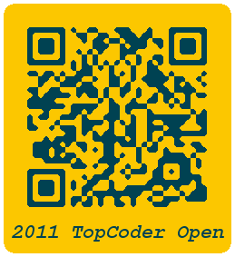
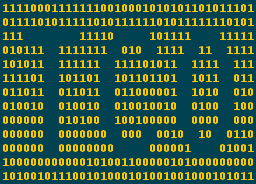

## Puzzle #5

One issue I had with TCO10 were the badges. On one hand, the text on them was pretty small and effectively unreadable unless viewed really close, so I sometimes talked to people having no idea who they were. On the other hand, the badges themselves look quite plain, bearing no hint that TCO is a tournament for some of the best coders in the world.

This year I've spent a lot of time on this, and here are three drafts of badges I suggest to use – well, not this time, but maybe in a year? Each badge belongs to one person from TCO11 Program and names the owner explicitly – well, if you know how to read it ;-)

Badge 1.

_A stylish indication that the wearer is related to IT; can be adjusted for any tournament colors._

Badge 2.

_Looks a bit plain but it's only a draft, the actual badge can be more elaborate. The only problem is that the colors are not too adjustable._

Badge 3.

_A simplistic design based on one of the most traditional marks of belonging to the world of computers._

### Solution

Badge 1 is a warm-up: it is simply a QR-code with rounded corners (which can be decoded anyways), colored in TCO blue and yellow. Very recognizable, and this kind of code can hold rather long texts; this badge held a link to <b>Mike Mirzayanov</b>'s profile.

Badge 2 is more complicated, but the image provides a strong clue to people who are at least a bit familiar with esoteric programming languages. The black structure on the top right of the image is quite specific to Piet language – it stops the program execution. The rest is easy – find a Piet interpreter, run the image in it and send me the answer <b>RAD.</b>. Off-by-one errors were possible if you converted the image from .png to other formats.

Badge 3 is the meanest one. The encoding in it was text-based one, not image-based. You had to extract the sequence of zeros and ones on the image and to decode it. This sequence was a Spoon program – short binary codes correspond to Brainfuck commands. The trick is, most Spoon implementations can't interpret these codes unless they are space-separated, while the concept of the language insists that the codes are extracted as prefix-free codes without any separators. One could either find a correct interpreter or write it himself to get the answer <b>lyrically</b>.

